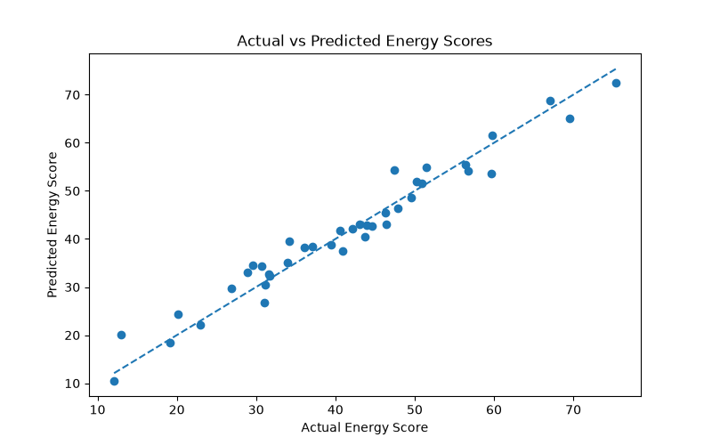

# Energy Calculator

A machine learning project that predicts a person's daily energy score based on lifestyle habits such as sleep, exercise, caffeine intake, stress, and screen time.

## Overview

This project explores how everyday lifestyle habits relate to an energy score using machine learning.

The project follows an end-to-end ML workflow:

- Synthetic data generation
- Data preprocessing
- Train/test split
- Feature scaling
- Model training
- Model comparison
- Model evaluation
- Prediction using a saved model
- Visualization of model performance

## Features Used

The model uses the following features:

- `hours_slept`
- `sleep_quality`
- `exercise_hours`
- `caffeine`
- `stress_level`
- `screen_time`

## Machine Learning Models

The project compares four approaches:

- Dummy Regressor - baseline
- Linear Regression
- Random Forest Regressor
- Gradient Boosting Regressor

The baseline provides a simple reference point for evaluating whether the trained models are learning useful patterns.

## Model Evaluation

The models are evaluated using:

- MAE - Mean Absolute Error
- MSE - Mean Squared Error
- RMSE - Root Mean Squared Error
- R-squared (R2)

### Results

| Model | MAE | MSE | RMSE | R2 |
|---|---:|---:|---:|---:|
| Baseline | 11.69 | 212.33 | 14.57 | -0.02 |
| Linear Regression | 2.44 | 9.47 | 3.08 | 0.95 |
| Random Forest | 4.54 | 31.41 | 5.60 | 0.85 |
| Gradient Boosting | 4.03 | 24.02 | 4.90 | 0.89 |

These results are based on an 80/20 train-test split with `random_state=42`.

## Model Visualization

### Actual vs Predicted Energy Scores

The plot compares the actual energy scores from the test set with the predictions made by the Linear Regression model.



## Project Structure

```text
sleep_energy_calculator/
|-- data/
|   |-- sleep_energy_data.csv
|-- models/
|   |-- energy_model.pkl
|   |-- energy_scaler.pkl
|-- src/
|   |-- energy_app.py
|   |-- generate_data.py
|   |-- predict_energy.py
|   |-- sleep_energy_model.py
|-- visuals/
|   |-- actual_vs_predicted.png
|-- .gitignore
|-- README.md
|-- requirements.txt